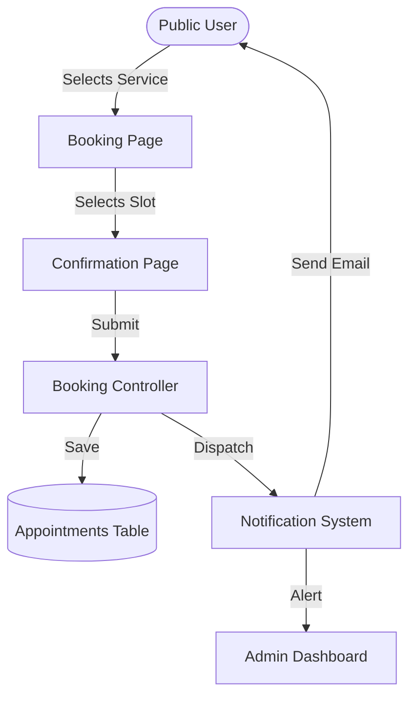
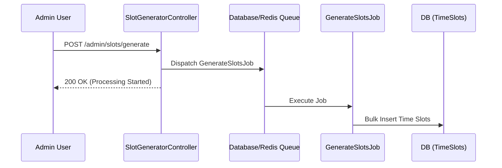

# FlowSlot - Enterprise Appointment Booking System

FlowSlot is a premium, enterprise-grade scheduling platform designed for efficiency and seamless user experience. Manage bookings, services, and customer notifications in one beautifully designed workspace.

**[Live Demo: flowslot.forahia.org.ng](https://flowslot.forahia.org.ng)**

## Key Features

- **Dynamic Booking**: User-friendly interface for selecting services and time slots.
- **Admin Dashboard**: Comprehensive management of appointments, services, and slot generation.
- **Real-time Notifications**: Automated email confirmations and updates.
- **Enterprise Security**: Role-based access control and restricted administrative functions.
- **Modern UI**: Built with Framer Motion for smooth transitions and a premium feel.

## Tech Stack

- **Backend**: Laravel 12 (PHP 8.3)
- **Frontend**: Inertia.js, React 18, Tailwind CSS
- **Animations**: Framer Motion
- **Icons**: Lucide React
- **Build Tool**: Vite
- **Database**: MySQL

## System Architecture & Documentation

### System Overview
FlowSlot leverages the powerful combination of Laravel and React via Inertia.js to provide a single-page application experience with the robust security and routing of a traditional backend.

### Services & Components
- **Booking Engine**: Manages slot availability and prevents double-booking.
- **Notification Service**: Handles email dispatch via SMTP (Mailtrap/Live).
- **Admin Portal**: Restricted area for service and appointment management.
- **Queue System**: Asynchronous processing of intensive tasks (like generating slots).

### GitHub Secrets
| Name | Value |
|---|---|
| `SSH_PRIVATE_KEY` | *(Your Private SSH Key)* |
| `PUSHER_APP_ID` | *(Your Pusher App ID)* |
| `PUSHER_APP_KEY` | *(Your Pusher Key)* |
| `PUSHER_APP_SECRET` | *(Your Pusher Secret)* |
| `PUSHER_APP_CLUSTER` | *(Your Pusher Cluster)* |

### Data Flow


### Queue Flow


### Reliability & Infrastructure
- **Webhook Handling**: Designed with idempotency in mind for future payment integrations (Stripe/Paystack).
- **CI/CD**: Fully automated deployment pipeline via GitHub Actions to WhoGoHost.
- **Data Integrity**: Atomic database transactions for booking confirmations to ensure consistency.

## Getting Started

### Prerequisites

- PHP 8.3+
- Composer
- Node.js & NPM

### Installation

1. Clone the repository
2. Install PHP dependencies:
   ```bash
   composer install
   ```
3. Install JS dependencies:
   ```bash
   npm install
   ```
4. Configure `.env` (Database, Mail, App URL).
5. Build assets:
   ```bash
   npm run build
   ```
6. Run migrations:
   ```bash
   php artisan migrate
   ```

## Documentation

- **[API Documentation (Swagger)](https://flowslot.forahia.org.ng/api/documentation)**: Interactive API playground and system schema.
- For architectural patterns and internal documentation, please refer to the `.docs` folder (coming soon).
